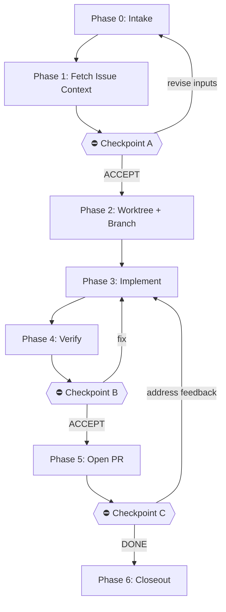

# Issue Implementation Runbook v1 (GitHub Issue → Branch → PR)

**Purpose:** Implement an existing GitHub issue in a consistent, reviewable way.

**Start condition:** You have:

- Target repo: `<owner>/<repo>`
- Issue number: `NN` (or `#NN`)

**End condition:** A PR is opened (and optionally iterated through review) that references the issue.

---

## Quick Reference



### Checkpoints (STOP POINTS)

| Checkpoint | When                          | Shows                                 | Proceeds to       |
| ---------- | ----------------------------- | ------------------------------------- | ----------------- |
| A          | Before any code changes       | `0.20-implementation-plan.md`         | Worktree + Branch |
| B          | Before opening PR             | `4.10-verification.md` + diff summary | PR creation       |
| C          | After review feedback arrives | comment resolution plan               | follow-up commits |

---

## Session Contract

- **Inputs are authoritative:** repo + issue number determine scope.
- **Isolation:** prefer a dedicated branch (and a worktree when helpful).
- **Determinism:** safe defaults; do not overwrite files unless requested.
- **Logging:** keep a lightweight, ordered artifact trail under a working folder.

---

## Artifact Naming Convention (Implementation)

All artifacts use stable ordering prefixes: `P.SS-<name>.md`

- `P` = phase number (0–6)
- `SS` = step number (00–99, use tens: 10, 20, 30...)

Suggested standard artifacts:

| Artifact                       | Purpose                                                           |
| ------------------------------ | ----------------------------------------------------------------- |
| `0.10-session-log.md`          | Running notes: commands run, decisions, surprises                 |
| `0.20-implementation-plan.md`  | Approach, scope, risks, verification plan (Checkpoint A artifact) |
| `1.10-issue-context.md`        | Parsed issue metadata, key requirements, links                    |
| `3.10-implementation-notes.md` | What changed and why (high level)                                 |
| `4.10-verification.md`         | Commands run + results (Checkpoint B artifact)                    |
| `5.10-pr-draft.md`             | PR title/body draft used with `--body-file`                       |
| `6.10-closeout.md`             | Summary + next steps                                              |

---

## Phase 0: Intake

### Required Inputs

The agent must collect:

1. **Repo:** `<owner>/<repo>`
2. **Issue:** `NN`
3. **Base branch:** typically `main` (confirm)
4. **Working folder:** under `_workshop/5-active/3-forge/<slug>/`

### Working Folder Rules

- If the issue body specifies a working folder path, use it.
- Otherwise, create a folder under `_workshop/5-active/3-forge/<slug>/`:
  - slug = kebab-case of title + `-<issue-number>`
  - Example: Issue #456 "Add user authentication" → `_workshop/5-active/3-forge/add-user-authentication-456/`
- If the folder already exists: **STOP** and ask the human.

---

## Phase 1: Fetch Issue Context (Automated)

1. Fetch issue details using `gh`:

   ```bash
   GH_PAGER=cat gh issue view <issue-number> \
     --repo <owner>/<repo> \
     --json number,title,url,state,body,labels,assignees \
     > <working-folder>/1.10-issue.json
   ```

2. Summarize the issue into `1.10-issue-context.md`:

   - Problem statement (1–3 bullets)
   - Acceptance criteria / DoD cues (bullets)
   - Constraints + out-of-scope
   - Links referenced by the issue
   - Any ambiguity that must be clarified

3. Create `0.20-implementation-plan.md` including:

   - Plan of attack (3–7 steps)
   - Repo touchpoints (files/dirs likely to change)
   - Risk list (2–5 bullets)
   - Verification plan (exact commands you will run)
   - Branch/worktree plan (names + paths)

---

## Checkpoint A — Approve to Start Implementation (STOP POINT)

**Present:**

```
══════════════════════════════════════════════════════════
 CHECKPOINT A: Approve to Start Implementation
══════════════════════════════════════════════════════════

Repo: <owner>/<repo>
Issue: #NN

Plan: <working-folder>/0.20-implementation-plan.md

To proceed, respond with acceptance
(e.g., "ACCEPT", "Proceed", "Ship it").

Any other response will be treated as revision guidance.
══════════════════════════════════════════════════════════
```

**Behavior:**

- Semantic acceptance → proceed to Phase 2 (worktree + branch setup)
- Any other response → revise the plan and re-present checkpoint

---

## Phase 2: Worktree + Branch Setup (Automated)

### Conventions

- Branch naming: `issue/<issue-number>-<slug>`
- One worktree per parallel agent (optional but recommended)

### Commands (template)

1. Ensure base branch is up to date:

   ```bash
   git checkout <base-branch>
   git pull --ff-only
   ```

2. Create branch:

   ```bash
   git checkout -b issue/<issue-number>-<slug>
   ```

If you are using worktrees:

```bash
git worktree add <worktree-path> -b issue/<issue-number>-<slug> <base-branch>
```

---

## Phase 3: Implement

### Create a Draft PR (Copilot-style “I’m working on this” signal)

Instead of editing the issue title, use a **draft PR** to signal active work.

Create the draft PR **as early as possible**, usually right after your first meaningful commit exists on the branch.

**What counts as "meaningful":** A commit that changes the codebase toward the stated solution (e.g., file structure, initial implementation, test scaffolding). Do not use draft PR creation as a blocker for exploration—create it after the first commit that proves direction.

Prerequisite: the branch must exist and contain at least one commit not on `<base-branch>`.

1. Prepare `5.10-pr-draft.md` early (you can update it later):

   - Summary (what you intend to do)
   - Scope boundaries
   - How to verify (placeholder is OK initially)
   - `Refs #NN` (use `Refs` while WIP; switch to `Closes` only when appropriate)

2. Push the branch:

   ```bash
   git push -u origin issue/<issue-number>-<slug>
   ```

3. Create the draft PR using the issue title:

   ```bash
   issue_title="$(GH_PAGER=cat gh issue view <issue-number> --repo <owner>/<repo> --json title --jq .title)"

   GH_PAGER=cat gh pr create \
     --draft \
     --repo <owner>/<repo> \
     --base <base-branch> \
     --head issue/<issue-number>-<slug> \
     --title "$issue_title" \
     --body-file <working-folder>/5.10-pr-draft.md
   ```

4. Record the resulting PR URL in `0.10-session-log.md` and `6.10-closeout.md`.

Guidelines:

- Keep changes small and reviewable.
- Prefer repo conventions (linting, formatting, architecture).
- Reference the issue in commit messages.

Commit template:

```bash
git commit -m "<type>: <summary>" -m "Refs #<issue-number>"
```

Update `3.10-implementation-notes.md` as you go (what changed + why).

### Session Logging

Maintain `0.10-session-log.md` as a running record:

- Commands executed (especially git/gh commands)
- Key decisions and their reasoning
- Blockers encountered and how resolved
- Surprises or deviations from the plan
- PR URL once created

This artifact is useful for retrospective review and debugging if the implementation needs to restart.

---

## Phase 4: Verify

1. Run the verification plan from `0.20-implementation-plan.md`.
2. Record results in `4.10-verification.md`:

   - Commands executed
   - Pass/fail summary
   - Follow-ups if flaky/slow

---

## Checkpoint B — Approve to Open PR (STOP POINT)

**Present:**

```
══════════════════════════════════════════════════════════
 CHECKPOINT B: Approve to Mark PR Ready for Review
══════════════════════════════════════════════════════════

Branch: issue/<issue-number>-<slug>

Verification: <working-folder>/4.10-verification.md

PR: <PR URL> (draft)

To proceed, respond with acceptance
(e.g., "ACCEPT", "Proceed", "Ship it").

Any other response will be treated as revision guidance.
══════════════════════════════════════════════════════════
```

**Behavior:**

- Semantic acceptance → proceed to Phase 5 (mark PR ready + update body)
- Any other response → revise implementation and re-present checkpoint

---

## Phase 5: Mark PR Ready + Update PR (Automated)

### Required Conventions

- Use `GH_PAGER=cat gh ...`
- Use `--body-file` (no heredocs)

1. Update `5.10-pr-draft.md` with final verification details:

   - Summary
   - What changed
   - How to verify (copy from `4.10-verification.md`)
   - Risk/rollback notes (if any)
   - `Closes #NN` or `Refs #NN` (choose appropriately)

2. Update the PR body (keep using `--body-file`):

   ```bash
   GH_PAGER=cat gh pr edit <PR URL> \
     --repo <owner>/<repo> \
     --body-file <working-folder>/5.10-pr-draft.md
   ```

3. Mark the PR ready for review:

   ```bash
   GH_PAGER=cat gh pr ready <issue-number> --repo <owner>/<repo>
   ```

4. (Optional) If you used `Refs #NN` while WIP and now intend auto-close on merge, update the PR body to `Closes #NN`.

---

## Checkpoint C — Review Feedback Loop (STOP POINT)

When PR feedback arrives:

1. Summarize requested changes (3–6 bullets)
2. Propose a resolution plan (what you will change, what you won't)
3. **STOP** and request approval before broad refactors

**Present:**

```
══════════════════════════════════════════════════════════
 CHECKPOINT C: Review Feedback & Resolution Plan
══════════════════════════════════════════════════════════

PR: <PR URL>

Feedback Summary:
- <change 1>
- <change 2>
...

Resolution Plan:
- <what you will do>
- <what you won't do + reasoning>

To proceed, respond with acceptance.
Any other response will be treated as revision guidance.
══════════════════════════════════════════════════════════
```

**Behavior:**

- Semantic acceptance → proceed to implementation of changes
- Any other response → revise the resolution plan and re-present checkpoint

---

## Phase 6: Closeout

Write `6.10-closeout.md`:

- Final status: PR opened / merged / paused
- Links: issue URL, PR URL
- What was shipped
- Remaining follow-ups (if any)

Note: The draft PR is the “in progress” signal; no issue title edits are required.
