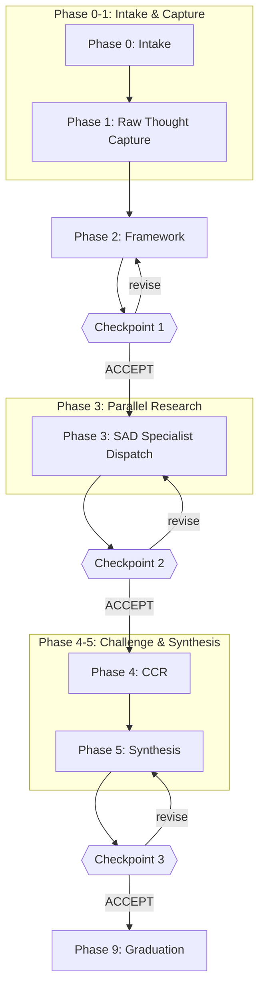

# Research Runbook v1.0

**Purpose:** Orchestrate research projects using PKDP stages with Claude subagent dispatch for parallel web research. Produces markdown research reports suitable for graduation to the research library.

**Key difference from ticket-refinement-runbook:** This runbook produces **research reports**, not GitHub issues.

**Supersedes:** Ad-hoc PKDP research sessions (now systematized)

---

## Quick Reference



### Checkpoints (STOP POINTS)

| Checkpoint | After Phase | Shows | Decision |
|------------|-------------|-------|----------|
| 1 | Phase 2 | Research questions + dispatch plan | Approve research scope |
| 2 | Phase 3 | Compiled specialist findings | Approve synthesis approach |
| 3 | Phase 5 | Draft research report | Approve for graduation |

### Risk Tiers (Validation Depth)

| Tier | Stages | Use Case |
|------|--------|----------|
| 0 | RTC + IDAS | Quick exploration, note capture |
| 1 | RTC + IDAS + SAD + ASR | Standard research |
| 2 | RTC + IDAS + SAD + CCR + ASR | Ambiguous topics, multiple valid positions |
| 3 | Full + HVA | Decision-grade knowledge |

---

## Session Contract

- **Mode:** Active session logging in the working folder
- **Working folder:** `_workshop/1-inbox/YYYY-MM-DD-HHMM__research-<slug>/`
- **Separation:** This runbook produces research reports. For implementation, use a separate runbook.
- **Determinism:** Safe defaults, no overwrites unless requested
- **Approval:** Semantic acceptance required at checkpoints

---

## Artifact Naming Convention

All artifacts use stable ordering prefixes: `P.SS-<name>.md`

- `P` = phase number (0, 1, 2, 3, 4, 5, 9)
- `SS` = step number (10, 20, 30...)

### Standard Artifacts

| Artifact | Purpose |
|----------|---------|
| `0.10-research-request.md` | Initial request and context |
| `0.20-research-classification.md` | Type, scope, risk tier |
| `1.10-rtc-raw-capture.md` | Raw thought capture |
| `1.20-research-questions.md` | Refined questions |
| `2.10-idas-framework.md` | Four-lens analysis |
| `2.20-sad-dispatch-plan.md` | Specialist dispatch plan |
| `3.10-sad-coordinator-log.md` | Research coordination |
| `3.20-sad-responses/` | Directory of specialist outputs |
| `4.10-ccr-consolidated.md` | Challenge review (Tier 2+ only) |
| `5.10-asr-synthesis.md` | Synthesis output |
| `5.20-draft-report.md` | Draft research report |
| `9.10-hva-decision.md` | Human validation decision |
| `9.20-graduation-record.md` | Graduation to research-library |
| `status.yaml` | Workflow state tracking |

---

## Phase 0: Intake & Classification

### Required Inputs

The agent must determine:

1. **Research topic:** One sentence describing what to research
2. **Starting context:** Optional - existing notes, prior research, or references
3. **Risk tier:** 0-3 (default: 1)

### Folder Creation

1. Generate timestamp slug: `YYYY-MM-DD-HHMM__research-<topic-slug>`
2. Create folder: `_workshop/1-inbox/<timestamp-slug>/`
3. Print the working folder path

### Slug Rules

- Kebab-case lowercase
- Replace non-directory-safe characters with `-`
- Max 40 characters for topic slug
- Fallback: `unknown-topic`

### Create Initial Artifacts

1. Copy `research-request-template.md` to `0.10-research-request.md`
2. Fill in the research topic and context
3. Create `status.yaml`:

```yaml
research_id: <timestamp-slug>
created: <ISO timestamp>
current_phase: 0
risk_tier: <selected tier>
status: active
checkpoints:
  cp1: pending
  cp2: pending
  cp3: pending
```

4. Proceed to Phase 1

---

## Phase 1: Raw Thought Capture (RTC)

### Purpose

Capture all raw thoughts, questions, assumptions, and existing knowledge about the topic without filtering or organizing.

### Process

1. **Brain dump:** Write down everything known or suspected about the topic
2. **List questions:** What questions need answering?
3. **Note assumptions:** What do we assume to be true?
4. **Identify sources:** What prior work or references exist?

### Output

Write to `1.10-rtc-raw-capture.md`:

```markdown
# Raw Thought Capture

## Topic
<one-line topic statement>

## Brain Dump
<unstructured thoughts, facts, opinions>

## Questions
1. <question>
2. <question>
...

## Assumptions
- <assumption 1>
- <assumption 2>

## Existing Knowledge
- <what we already know>

## Potential Sources
- <sources to consult>
```

### Extract Research Questions

From the RTC output, distill into `1.20-research-questions.md`:

```markdown
# Research Questions

## Primary Question
<The main question this research aims to answer>

## Secondary Questions
1. <supporting question>
2. <supporting question>

## Out of Scope
- <explicitly excluded topics>
```

Proceed to Phase 2.

---

## Phase 2: Framework (IDAS)

### Purpose

Apply Inquiry-Driven Analytical Synthesis using the four-lens framework to structure the research approach.

### Four-Lens Analysis

| Lens | Focus | Questions to Answer |
|------|-------|---------------------|
| First Principles | Fundamental truths | What must be true regardless of implementation? |
| Best Practices | Industry patterns | What do experts recommend? What works? |
| Guru Wisdom | Expert heuristics | What do thought leaders say? What's the intuition? |
| Anti-Patterns | Documented failures | What doesn't work? What should we avoid? |

### Process

1. Review `1.20-research-questions.md`
2. For each question, identify which lenses apply
3. Map questions to specialist agents

### Output

Write to `2.10-idas-framework.md` using the `idas-framework-template.md`.

### Create Dispatch Plan

Write to `2.20-sad-dispatch-plan.md`:

```markdown
# SAD Dispatch Plan

## Risk Tier: <N>

## Specialists to Dispatch

### First Principles Specialist
- Questions assigned: <list>
- Search focus: <academic, foundational sources>
- Timebox: <5-10 minutes>

### Best Practices Specialist
- Questions assigned: <list>
- Search focus: <industry, standards, documentation>
- Timebox: <5-10 minutes>

### Guru Wisdom Specialist
- Questions assigned: <list>
- Search focus: <thought leaders, conference talks, expert blogs>
- Timebox: <5-10 minutes>

### Anti-Patterns Specialist
- Questions assigned: <list>
- Search focus: <failure analyses, war stories, what-not-to-do>
- Timebox: <5-10 minutes>

## Parallel Dispatch Order
All specialists launch simultaneously via Task tool.
```

### Update Status

```yaml
current_phase: 2
```

---

## Checkpoint 1 - Approve Research Scope (STOP POINT)

**Present:**

```
══════════════════════════════════════════════════════════
 CHECKPOINT 1: Approve Research Scope
══════════════════════════════════════════════════════════

Working folder: <path>

Research topic: <topic>
Risk tier: <N>

Primary question:
<question>

Secondary questions:
<list>

Dispatch plan summary:
- First Principles: <N questions>
- Best Practices: <N questions>
- Guru Wisdom: <N questions>
- Anti-Patterns: <N questions>

Estimated research time: <X minutes per specialist>

Please review the framework above.

To proceed to parallel research, respond with acceptance
(e.g., "ACCEPT", "Looks good", "Proceed").

Any other response will be treated as revision guidance.
══════════════════════════════════════════════════════════
```

**Behavior:**

- Semantic acceptance -> proceed to Phase 3 (SAD)
- Any other response -> revise framework, re-present checkpoint

---

## Phase 3: Specialist Agent Dispatch (SAD)

### Purpose

Launch parallel subagent research using Claude's Task tool with WebSearch and WebFetch access.

### Dispatch Protocol

For each specialist in the dispatch plan:

1. **Create prompt** using `specialist-prompt-template.md`
2. **Launch Task agent:**
   ```
   Task(
     description: "<lens>-research-<topic-slug>",
     prompt: <specialist prompt>,
     subagent_type: "general-purpose",
     model: "haiku"  // Fast, cost-effective for research
   )
   ```
3. **Track in coordinator log**
4. **Collect response** to `3.20-sad-responses/<specialist>.md`

### Parallel Dispatch

Launch ALL specialists in a single message with multiple Task tool calls:

```
[Task: first-principles-specialist]
[Task: best-practices-specialist]
[Task: guru-wisdom-specialist]
[Task: anti-patterns-specialist]
```

### Coordinator Log

Write to `3.10-sad-coordinator-log.md`:

```markdown
# SAD Coordinator Log

## Dispatch Record

| Specialist | Launched | Status | Duration | Findings |
|------------|----------|--------|----------|----------|
| First Principles | <time> | <status> | <Xm> | <summary> |
| Best Practices | <time> | <status> | <Xm> | <summary> |
| Guru Wisdom | <time> | <status> | <Xm> | <summary> |
| Anti-Patterns | <time> | <status> | <Xm> | <summary> |

## Coordination Notes
<any issues, adjustments, or observations>
```

### Response Collection

Each specialist response is saved to `3.20-sad-responses/<specialist-name>.md`:

```markdown
# <Specialist> Research Response

## Questions Addressed
<list of questions from dispatch plan>

## Findings

### <Finding 1>
- **Source:** <URL or reference>
- **Summary:** <key point>
- **Confidence:** <high/medium/low>
- **Relevance:** <to which question>

### <Finding 2>
...

## Key Insights
<synthesized insights from this lens>

## Gaps Identified
<what couldn't be found or remains unclear>

## Recommended Follow-up
<if any>
```

### Update Status

```yaml
current_phase: 3
```

---

## Checkpoint 2 - Approve Synthesis Approach (STOP POINT)

**Present:**

```
══════════════════════════════════════════════════════════
 CHECKPOINT 2: Approve Synthesis Approach
══════════════════════════════════════════════════════════

Working folder: <path>

Specialist findings summary:

First Principles:
- <N findings>, <key insight>

Best Practices:
- <N findings>, <key insight>

Guru Wisdom:
- <N findings>, <key insight>

Anti-Patterns:
- <N findings>, <key insight>

Gaps identified:
- <list any gaps across specialists>

Risk tier: <N>
CCR required: <Yes for Tier 2+, No for Tier 0-1>

Please review the findings above.

To proceed to synthesis, respond with acceptance.

Any other response will be treated as revision guidance.
══════════════════════════════════════════════════════════
```

**Behavior:**

- Semantic acceptance:
  - Tier 2+: proceed to Phase 4 (CCR)
  - Tier 0-1: skip to Phase 5 (Synthesis)
- Any other response -> revise/extend research, re-present checkpoint

---

## Phase 4: Critical Challenge Review (CCR) - Tier 2+ Only

### Purpose

Adversarial review to challenge assumptions, find blind spots, and stress-test findings.

### CCR Prompts

Use devil's advocate framing:

1. **Assumptions challenge:** What assumptions in the findings might be wrong?
2. **Evidence gaps:** Where is the evidence weak or missing?
3. **Contradictions:** Do any findings contradict each other?
4. **Alternative interpretations:** What other explanations exist?
5. **Missing perspectives:** What viewpoints weren't represented?

### Output

Write to `4.10-ccr-consolidated.md`:

```markdown
# Critical Challenge Review

## Challenged Assumptions
- <assumption>: <challenge>

## Evidence Gaps
- <gap description>

## Contradictions Found
- <contradiction and resolution approach>

## Alternative Interpretations
- <alternative view>

## Missing Perspectives
- <perspective not represented>

## Verdict
<PROCEED / PROCEED-WITH-MITIGATIONS / REGRESS-TO-SAD>

## Mitigations Required
<if applicable>
```

### Update Status

```yaml
current_phase: 4
```

Skip to Phase 5.

---

## Phase 5: Adjudicated Synthesis & Resolution (ASR)

### Purpose

Synthesize all specialist findings (and CCR challenges if Tier 2+) into a coherent research report.

### Process

1. **Review all inputs:**
   - All files in `3.20-sad-responses/`
   - `4.10-ccr-consolidated.md` (if exists)
2. **Adjudicate conflicts:** When specialists disagree, document the resolution
3. **Synthesize findings:** Combine into coherent narrative
4. **Draft report:** Create structured output

### ASR Output

Write to `5.10-asr-synthesis.md`:

```markdown
# ASR Synthesis

## Adjudication Record

### Conflict 1: <description>
- Position A: <view from specialist X>
- Position B: <view from specialist Y>
- Resolution: <chosen position and rationale>

### Conflict 2: ...

## Integrated Findings

<Synthesized narrative combining all specialist inputs>

## Confidence Assessment

| Finding | Confidence | Basis |
|---------|------------|-------|
| <finding> | <high/medium/low> | <evidence quality> |

## Open Questions
- <questions that remain unanswered>

## Recommendations
- <actionable recommendations>
```

### Draft Report

Write to `5.20-draft-report.md` using `research-report-template.md`.

### Update Status

```yaml
current_phase: 5
```

---

## Checkpoint 3 - Approve for Graduation (STOP POINT)

**Present:**

```
══════════════════════════════════════════════════════════
 CHECKPOINT 3: Approve for Graduation
══════════════════════════════════════════════════════════

Working folder: <path>

Draft report: <path to 5.20-draft-report.md>

Report summary:
- Title: <title>
- Primary finding: <key conclusion>
- Confidence: <high/medium/low>
- Open questions: <N remaining>

Risk tier completed: <N>
CCR applied: <Yes/No>

Suggested library category: <category>
Suggested filename: <slug>.md

Please review the draft report.

To graduate to research-library, respond with acceptance.

To revise, provide feedback.

To reject (abandon research), say "reject".
══════════════════════════════════════════════════════════
```

**Behavior:**

- Semantic acceptance -> proceed to Phase 9 (Graduation)
- "reject" -> mark research as abandoned, archive folder
- Any other response -> revise report, re-present checkpoint

---

## Phase 9: Graduation (HVA Complete)

### Human Validation & Acceptance

On Checkpoint 3 acceptance:

1. **Write HVA decision** to `9.10-hva-decision.md`:

```markdown
# HVA Decision

## Decision: ACCEPT

## Rationale
<why this research is ready for graduation>

## Accepted At
<ISO timestamp>

## Accepted By
Human validation at Checkpoint 3
```

2. **Determine library category:**
   - `foundations/` - Epistemological, theoretical
   - `patterns/` - Reusable approaches
   - `practices/` - How-to, implementation guidance
   - `analyses/` - Comparative, evaluative
   - `explorations/` - Experimental, speculative

3. **Copy report to research-library:**
   ```bash
   cp <working-folder>/5.20-draft-report.md \
      praxis-ai/research-library/<category>/<slug>.md
   ```

4. **Update CATALOG.md:**
   - Add entry with: ID, title, category, consensus level, date, tags

5. **Write graduation record** to `9.20-graduation-record.md`:

```markdown
# Graduation Record

## Research ID
<timestamp-slug>

## Library Location
praxis-ai/research-library/<category>/<slug>.md

## CATALOG Entry Added
<entry details>

## Graduation Date
<ISO timestamp>

## Source Artifacts Preserved
<list of artifacts in working folder>
```

6. **Move working folder to completed:**
   ```bash
   mv _workshop/1-inbox/<timestamp-slug> _workshop/9-items/<timestamp-slug>
   ```

### Update Status

```yaml
current_phase: 9
status: graduated
checkpoints:
  cp1: accepted
  cp2: accepted
  cp3: accepted
library_path: <path>
graduated_at: <ISO timestamp>
```

---

## Resuming a Prior Session

When picking up work from a previous session:

1. Read `status.yaml` to determine current phase
2. Read all artifacts in phase order
3. Resume at the current phase
4. Check checkpoints status to understand what's been approved

---

## Appendix: Specialist Prompt Structure

See `specialist-prompt-template.md` for the full template. Key elements:

1. **Role framing:** "You are a [lens] research specialist..."
2. **Questions:** Specific questions from dispatch plan
3. **Search guidance:** What types of sources to prioritize
4. **Output format:** Structured findings template
5. **Timebox:** Expected duration
6. **Quality bar:** Evidence standards

---

## Appendix: Risk Tier Selection Guide

| Indicator | Suggested Tier |
|-----------|----------------|
| Quick note capture, personal reference | Tier 0 |
| Standard topic research, moderate stakes | Tier 1 |
| Contested topic, multiple valid positions | Tier 2 |
| High-stakes decision, needs validation | Tier 3 |

**When in doubt, use Tier 1.** It provides good coverage without the overhead of CCR.

---

## Appendix: Template References

| Template | Purpose | Location |
|----------|---------|----------|
| `research-request-template.md` | Phase 0 intake | Same directory |
| `idas-framework-template.md` | Phase 2 four-lens | Same directory |
| `sad-dispatch-template.md` | Phase 3 dispatch | Same directory |
| `specialist-prompt-template.md` | Subagent prompts | Same directory |
| `research-report-template.md` | Final report | Same directory |

---

## Appendix: Differences from Ticket Refinement Runbook

| Aspect | Ticket Refinement | Research Runbook |
|--------|-------------------|------------------|
| Output | GitHub issue | Research report |
| Destination | GitHub | research-library |
| CCR focus | Expert roles (PO, Dev, QA) | Adversarial challenge |
| Specialists | None (single agent) | Four-lens parallel dispatch |
| Location | `bench/wip/` | `_workshop/1-inbox/` |
| Graduation | Archive to `bench/trash/` | Copy to `research-library/` |
